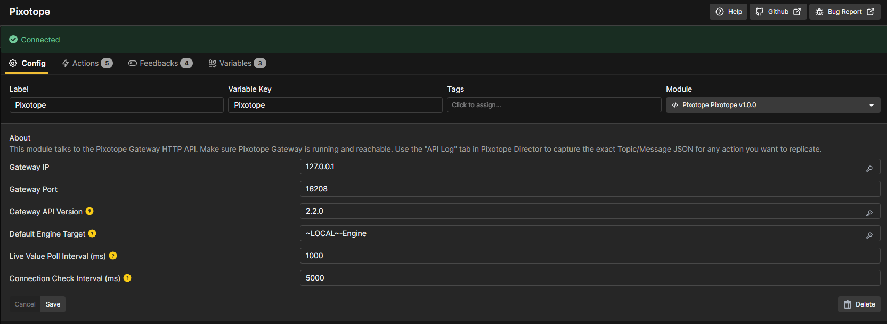
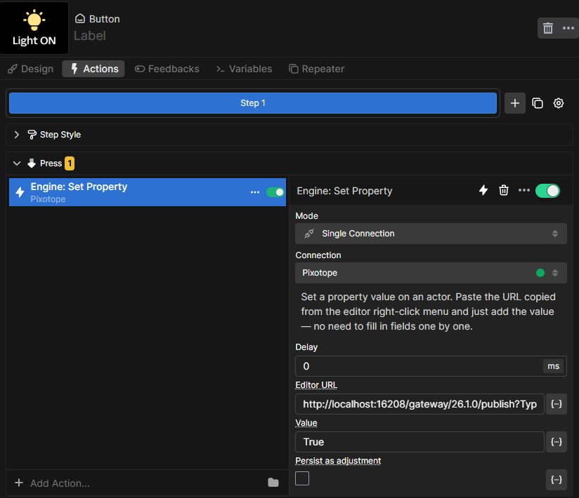
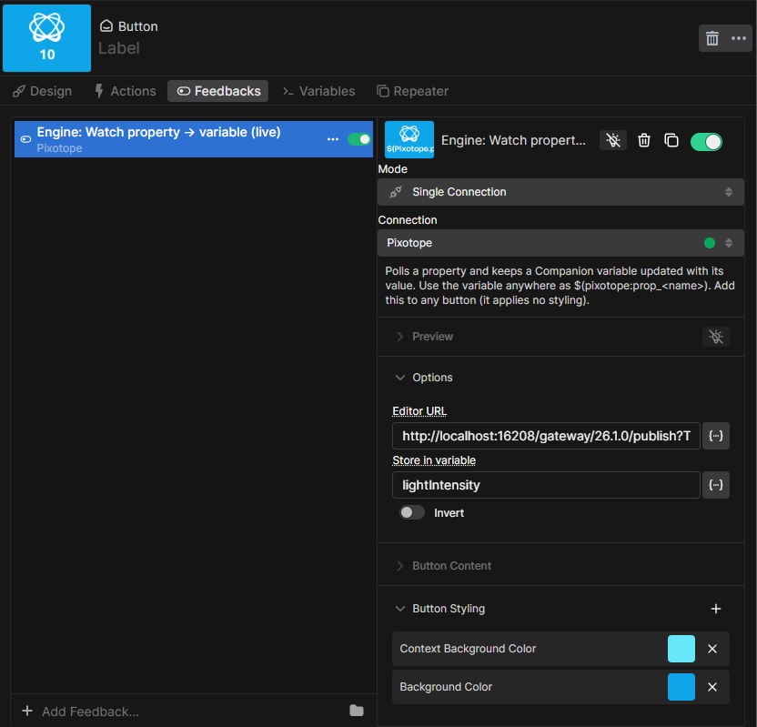

## Pixotope (Gateway API)

Control Pixotope virtual production graphics from Companion/Buttons by sending commands to the
**Pixotope Gateway** HTTP API.

### Compatibility

- Works with Bitfocus **Companion 4.x** and Bitfocus **Buttons**.
- Requires a running Pixotope system with **Pixotope Gateway** reachable on the network.

### Requirements

- Network access from the Companion/Buttons host to the Gateway machine.
- The Gateway exposes a single publish endpoint:

  ```
  http://{Gateway IP}:{Port}/gateway/{API Version}/publish
  ```

### Configuration

Set these in the connection settings:

- **Gateway IP** — IP of the machine running Pixotope Gateway (default `127.0.0.1`).
- **Gateway Port** — Gateway HTTP port (default `16208`).
- **Gateway API Version** — the version segment of the publish URL (default `2.2.0`). The Gateway
  does not validate this, so the default is fine in most setups.
- **Default Engine Target** — service name used when an action leaves the target blank
  (default `~LOCAL~-Engine`).
- **Live Value Poll Interval** — how often (ms) live "watch" feedbacks refresh (default `1000`).
  Lower = fresher, more traffic.
- **Connection Check Interval** — heartbeat used only when nothing is being watched
  (default `5000`; `0` disables it).

The connection indicator turns green once the Gateway responds.



### Finding object and Store paths

You rarely type these by hand:

- **Editor right-click** — in the Pixotope editor, right-click a property on an object to copy its
  Gateway URL, e.g.
  `…/publish?Type=Call&Target=~LOCAL~-Engine&Method=GetProperty&ParamObjectSearch=DirectionalLight_0.LightComponent0&ParamPropertyPath=Intensity`.
  Paste it into **Set Property**, **Get Property**, or the property feedbacks.
- **Director API Log** — open the **API Log** tab, perform the action in the UI, then copy the
  logged Topic/Message JSON into **Raw API Request**.
- **Store paths** — browse the Store tree by opening this in a browser, then drill into a parent to
  see its child keys:
  `http://{Gateway IP}:{Port}/gateway/2.2.0/publish?Type=Get&Target=Store&Name=State`
  (e.g. `State.General.FrameRate`). A wrong or empty path returns `null`, which shows as a blank
  variable.

### Actions

- **Engine: Set Property** — set a property value. Paste the editor URL and enter the value.
- **Engine: Get Property** — read a property value once (on press) into a Companion variable.
- **Engine: Call Event (Blueprint)** — trigger a Blueprint event (CallFunction); paste the editor URL.
  To pass arguments, append `ParamFunctionArguments` as a **JSON array with text values quoted**,
  e.g. `…&ParamFunctionArguments=[10,"HELLO"]` (numbers bare, strings in quotes). Unquoted values
  like `[10,HELLO]` work in a browser but not here, because the module needs valid JSON.
- **Store: Set Value** — set a show-wide value in the Pixotope Store.
- **Raw API Request** — send any Topic/Message; paste payloads captured from the Director API Log.
- **Clear stored property variables** — remove all `$(pixotope:prop_*)` variables created at runtime.

Set Property with a pasted editor URL and a value:



**Set Property — about the value:** the URL you copy from Pixotope includes the property's _current_
value. The module ignores any value embedded in the URL — paste the URL into the **Editor URL**
field (it provides the object and property to target) and type the value you want to send in the
separate **Value** field.

### Raw API Request — examples

The **Raw API Request** action sends any Topic/Message. Field rules: **Name** is used only for
`Set`/`Get`; **Method** is used only for `Call`; a blank **Target** means the _Default Engine
Target_. It is fire-and-forget — it logs the HTTP status at debug but does not display returned
values (use the **Watch** feedbacks to read values back).

**Set a property** (e.g. change a light's intensity)

- Topic Type: `Call`
- Target: _(blank, or `~LOCAL~-Engine`)_
- Method: `SetProperty`
- Message:

  ```json
  { "Params": { "ObjectSearch": "DirectionalLight_1.LightComponent0", "PropertyPath": "Intensity", "Value": 50 } }
  ```

**Get a property**

- Topic Type: `Call`
- Method: `GetProperty`
- Message:

  ```json
  { "Params": { "ObjectSearch": "DirectionalLight_1.LightComponent0", "PropertyPath": "Intensity" } }
  ```

**Call a function on an actor**

- Topic Type: `Call`
- Method: `CallFunction`
- Message:

  ```json
  { "Params": { "ObjectSearch": "MyActor", "FunctionName": "Play", "FunctionArguments": {} } }
  ```

**Get a Store value**

- Topic Type: `Get`
- Target: `Store`
- Name: `State.General.FrameRate`
- Message: `{}`

**Set a Store value**

- Topic Type: `Set`
- Target: `Store`
- Name: `State.General.<writable path>`
- Message: `{ "Value": "yourValue" }`

### Feedbacks

- **Gateway connection OK** — turns the button green while the Gateway is reachable.
- **Engine: Property differs from default** — paste a property's editor URL; turns the button
  orange while the property's value differs from its default.
- **Engine: Watch property → variable (live)** — paste a property's editor URL and a variable name;
  the property is polled and kept live in `$(pixotope:prop_<name>)`. Applies no styling.
- **Store: Watch value → variable (live)** — the same, but reads a value from the Pixotope **Store**
  (a state path such as `State.General.FrameRate`).

### Variables

- `$(pixotope:connection_status)` — `Connected` / `Disconnected` / `Connecting`.
- `$(pixotope:gateway_url)` — the resolved publish URL.
- `$(pixotope:prop_<name>)` — a property or Store value, kept live by a **Watch** feedback or set on
  demand by **Get Property**. Module variables are global, so reference them from any button,
  trigger, or text field. They are created at runtime (not predefined) and last for the session;
  removing a Watch feedback removes its variable, and **Clear stored property variables** removes
  them all.

A button displaying a live property value via a watched variable:



### Network traffic & freshness (built for live use)

- **Only what's on screen is polled** — a request is sent only for values with a live Watch feedback
  attached.
- **No redundant heartbeat** — while values are being watched, those polls prove reachability, so the
  separate connection check is skipped; the indicator is driven by the watch traffic.
- **Pooled keep-alive connection** and **no overlapping polls**, so the Gateway isn't hammered.
- Actions fire immediately on press and are never delayed by polling.

### Troubleshooting

- **Variable is blank** — the Store/property path returned `null`; double-check the path (see
  _Finding object and Store paths_). The debug log shows `… returned null` when this happens.
- **Connection indicator red** — the Gateway is unreachable. The module reconnects automatically
  once it responds again; to force it, disable/re-enable the connection. If the Gateway process
  itself stopped, restart Pixotope (server-side; the module cannot recover that).
- **Module won't appear / load after re-importing** — remove the previously installed version first,
  then import the new package, and restart the app.

### Authentication

The Pixotope Gateway API is designed for trusted studio LANs and does not use API keys. Keep the
Gateway on a protected network.
